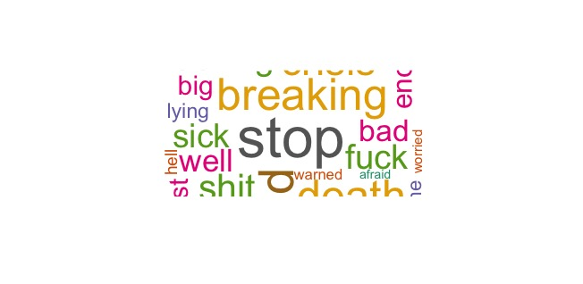
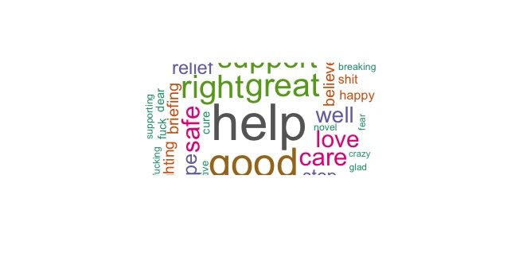
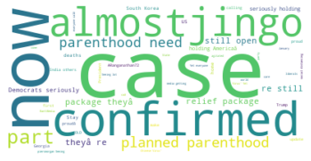

# COVID-19 NLP & Mobility

This repository contains a simplified, reproducible example of the sentiment analysis and mobility integration pipeline from my research on public sentiment and mobility behavior during the early COVID-19 pandemic.

> **Intro:**  
> This study investigates the influence of public sentiment on mobility behavior during the early COVID-19 pandemic in the United States. Using county-level mobility metrics merged with sentiment scores derived from millions of COVID-19–related tweets, we apply a Regression Discontinuity in Time (RDiT) framework to estimate behavioral responses to lockdown policies. We find that sentiment, particularly neutral-tone content, is significantly associated with mobility reductions, suggesting that public mood played a role in compliance with public health guidelines.

**Note:** Due to data privacy restrictions, this repo contains only synthetic examples, visual summaries, and selected code excerpts to demonstrate the workflow.

---

## Project structure

## Pipeline overview

1. **Preprocessing** (`Preprocess.ipynb`)  
   - Tokenization  
   - Stopword removal  
   - Basic text normalization  

2. **Sentiment scoring** (`Create_Sentiment_Score.ipynb`)  
   - Sentiment classification with **VADER** (Valence Aware Dictionary and sEntiment Reasoner)  
   - Generates `compound`, `pos`, `neg`, `neu` scores for each tweet  

3. **Post-processing & aggregation** (`Sentiment_Score_Processing.R`)  
   - Aggregates sentiment scores to the county–day level  

4. **Merging with mobility data** (not included here due to licensing)  

5. **Policy effect estimation** (`RD_first_attempt.R`)  
   - Prototype Regression Discontinuity in Time (RDiT) around policy cutoffs  

---

## Sample results

While raw tweets are not included, we provide word clouds to illustrate the most frequent words in each sentiment category.

**Negative tweets**  

**Positive tweets**  

**Neutral tweets**  

---

## Example sentiment classification

*(Examples are fabricated to match the data structure; no actual tweets are included)*

- **Positive:** "Working from home going fine, keeping safe."  
- **Negative:** "Lockdown announced today, worried about jobs."  
- **Neutral:** "COVID-19 press conference scheduled at 2 PM."  

---

## Methods

- **Sentiment Analysis:** VADER (rule-based; effective for short social text)  
- **Aggregation:** Mean sentiment by county × date  
- **Causal Design:** Regression Discontinuity in Time (RDiT) around lockdown dates  

---

## Ethics & data use

- No original tweet text is distributed.  
- All visualizations are generated from aggregated or synthetic text.  
- Users of this repo should follow the [Twitter Developer Agreement](https://developer.twitter.com/en/developer-terms/agreement-and-policy) when working with tweet data.

---

## Dependencies

See each notebook/script for environment details. Core Python libraries include:
- `pandas`
- `numpy`
- `nltk`
- `vaderSentiment`
- `matplotlib`
- `wordcloud`

R scripts require:
- `tidyverse`
- `lubridate`
- `rdrobust`

---

## Author
Mengshan Zhao  
🌐 [Website](https://www.mengshanzhao.com) | 🐙 [GitHub](https://github.com/MengshanZhao) | ✉️ mengshan.zhao@wsu.edu

---

## License
MIT License — reuse with attribution.
